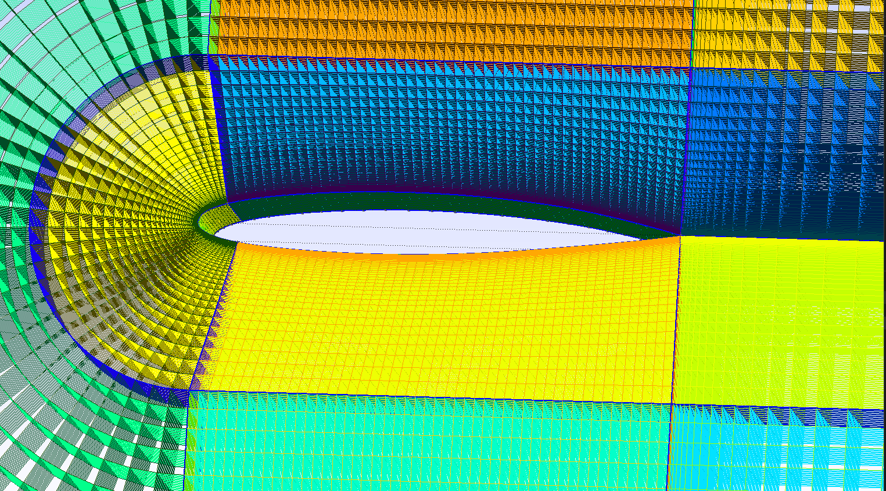

# Gallery
Graphical user interface of GMSH. After setting all the parameters as you prefer, for generating the mesh just click on:\\
Mesh->2D  or Mesh->3D.

Screen shot of GMSH creating mesh

Detail of the 3D c141a mesh

Sharp leading edge example

Non Sharp leading edge example

Class Shape Transformation example
